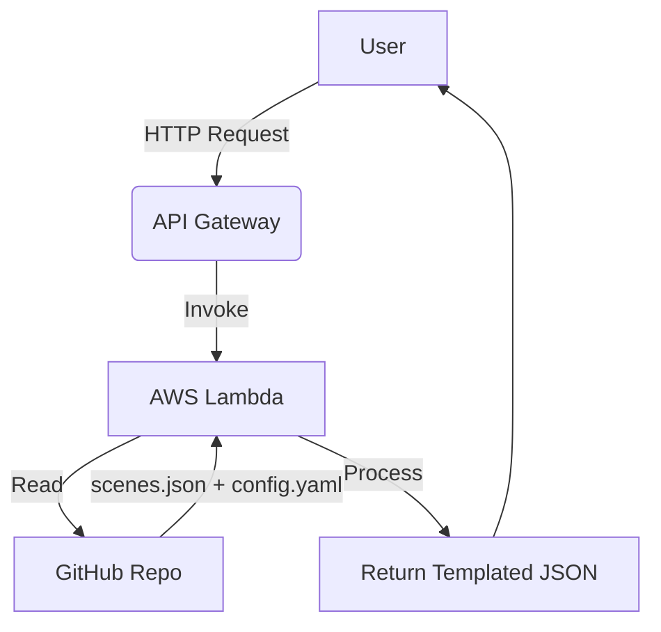

# obs-template
Create OBS Scene collections

```mermaid
graph TD
    A[User] -->|HTTP Request| B(API Gateway)
    B -->|Invoke| C[AWS Lambda]
    C -->|Read| D[GitHub Repo]
    D -->|scenes.json + config.yaml| C
    C -->|Process| E[Return Templated JSON]
    E --> A
```